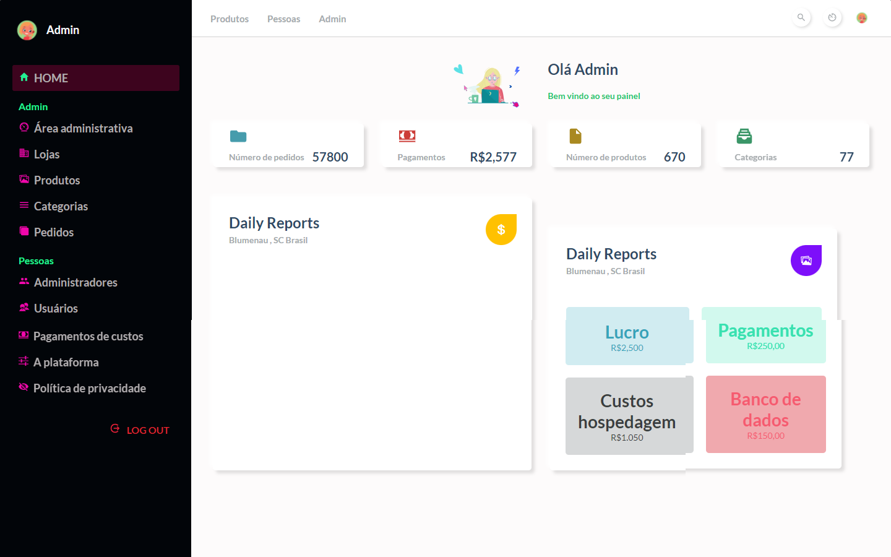

# Tela de administrador de painel 🎯

<h1>Dashboard Admin</h1>

<a href="https://vercel.com/luvalentinaa/screen-dashboard-admin">Acesse em Vercel 🔗</a>
 
   

# Desafio
Esse desafio foi fazer uma tela de administrador de painel 
 <strong>DashboardAdmin</strong>.   

# Tecnologias utilisadas: 
REACT 
Framework ou linguagem que preferir

# Como começar:
1 - Use esse template (clicando em Use this template) ou faça um fork deste repositório com o código inicial 
2 - Leia as instruções no readme.md 
3 - Comece a codar! 
4 - Compartilhe seu resultado com a comunidade :) 

# Requisitos:
- Sua página deve se parecer o mais próximo possível do design 
- Sua página deve ser responsiva 

# Design:
Modelo está disponível  `./design` 

